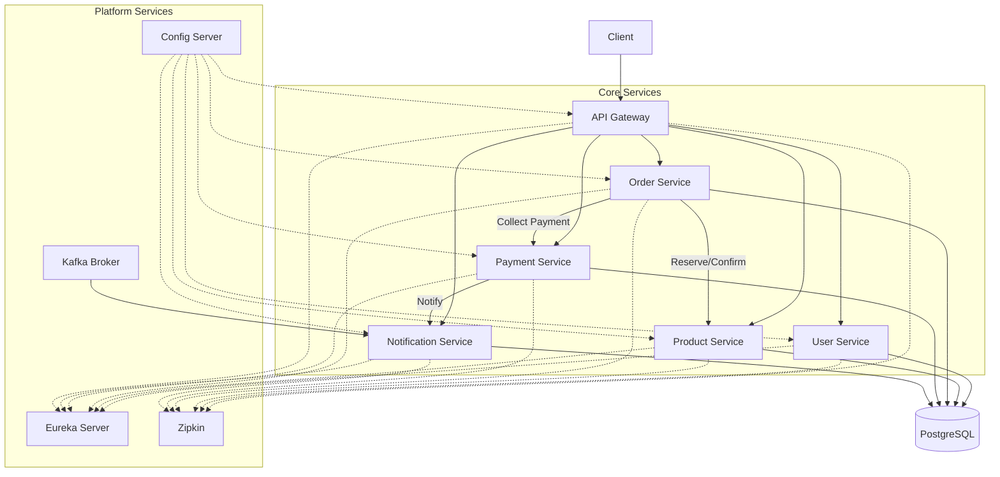

# Ecommerce Microservices Platform

An end-to-end ecommerce domain implemented as Spring Boot microservices. The codebase demonstrates pragmatic service decomposition, shared infrastructure with Spring Cloud, resilient communication patterns, and production-oriented guardrails without deviating from the architecture established in this repository.

## Feature Highlights

- Independent Spring Boot services with dedicated data models and DTOs
- API Gateway handling routing, validation, and cross-cutting policies
- Service discovery and centralized configuration via Spring Cloud
- PostgreSQL persistence backing transactional workloads with service-specific schemas
- Kafka- and email-ready infrastructure for asynchronous messaging
- Comprehensive REST APIs for ordering, catalog management, payments, users, and notifications

## Repository Layout

| Path | Description |
| --- | --- |
| `service/config-server` | Spring Cloud Config Server sourcing shared configuration. |
| `service/discovery` | Eureka discovery server so services can locate each other. |
| `service/gateway` | API Gateway routing external requests to the downstream services. |
| `service/user` | Identity, authentication, and profile management service. |
| `service/product` | Catalog, inventory reservation, and product search service. |
| `service/order` | Order lifecycle orchestration and status tracking service. |
| `service/payment` | Payment processing, refunds, and reconciliation service. |
| `service/notification` | Notification dispatch, retries, and history service. |
| `database` | Database migration scripts and seed data (PostgreSQL focus). |
| `docs/` | Supplemental architecture notes and sequence diagrams. |

## Service Catalog

| Service | Base Path | What it does | Notable Capabilities |
| --- | --- | --- | --- |
| **Gateway** | `/` | Central ingress built on Spring Cloud Gateway. | Routes client traffic to product, user, order, payment, and notification services while enforcing shared filters and JWT checks. |
| **User Service** | `/api/auth`, `/api/users` | Handles registration, login, token refresh, and user profile lookups. | Supports user registration, login, token refresh, logout, current-user profile retrieval, and inter-service public lookups.【F:service/user/src/main/java/com/nahid/userservice/controller/AuthController.java†L21-L49】【F:service/user/src/main/java/com/nahid/userservice/controller/UserController.java†L27-L37】 |
| **Product Service** | `/api/v1/products` | Manages catalog data and stock reservations. | Supports CRUD, category browsing, rich search filters, featured/low-stock feeds, and Try/Confirm/Cancel inventory reservations for orders.【F:service/product/src/main/java/com/nahid/product/controller/ProductController.java†L27-L141】 |
| **Order Service** | `/api/v1/orders` | Coordinates the end-to-end order lifecycle. | Creates orders, retrieves by ID or order number, paginates listings, filters by user or status, updates status, counts orders, and handles cancellation flows.【F:service/order/src/main/java/com/nahid/order/controller/OrderController.java†L27-L113】 |
| **Payment Service** | `/api/v1/payments` | Processes payments and post-payment actions. | Accepts payment requests, fetches payment history by order/user/status, exposes aggregation (total paid), and offers update/cancel/refund/retry operations.【F:service/payment/src/main/java/com/nahid/payment/controller/PaymentController.java†L27-L105】 |
| **Notification Service** | `/api/v1/notifications` | Stores and delivers user notifications. | Retrieves notifications (single, user-scoped, paginated), tracks status, retries failures, exposes health and manual creation endpoints.【F:service/notification/src/main/java/com/nahid/notification/controller/NotificationController.java†L25-L108】 |
| **Config Server** | `/` | Supplies shared configuration properties. | Bootstraps service-specific `application` profiles and secrets; see `service/config-server`. |
| **Discovery Server** | `/` | Manages service registry. | Keeps track of service instances for the gateway and direct inter-service calls. |

> Note: The notification controller declares `"/api/v1//notifications"`; Spring normalizes this to the effective `/api/v1/notifications` route at runtime.【F:service/notification/src/main/java/com/nahid/notification/controller/NotificationController.java†L25-L108】

## Architecture Overview



The diagram mirrors the implementation in this repository: every service registers with Eureka, loads shared configuration, persists to its own datastore, and emits tracing data.

## Local Development

### Prerequisites

- Java 21
- Maven 3.9+
- Docker & Docker Compose (for infrastructure like PostgreSQL, Kafka, Zipkin, MailDev)

### Start Shared Infrastructure

```bash
docker compose up -d
```

This launches PostgreSQL, pgAdmin, Zipkin, Kafka (with Zookeeper), and MailDev as defined in `docker-compose.yml`.

### Run a Service

Each microservice lives under `service/<name>`. To start one locally:

```bash
cd service/order
mvn clean install
mvn spring-boot:run
```

Services will import configuration from the config server, register with Eureka, and publish tracing spans to Zipkin once the supporting containers are up.

## Observability & Security

- Distributed tracing via Zipkin; spans are emitted from every service through Spring Cloud Sleuth integration.
- Health endpoints available on `/actuator/health` for readiness checks.
- Keycloak integration hooks exist in the gateway and user service for OAuth2/OIDC token validation (configure via the config server repository).
- Structured logging and API response envelopes standardize payloads across services.

## Documentation

For deeper design notes, refer to:

- [`docs/system-reanalysis.md`](docs/system-reanalysis.md)
- [`docs/order-processing-redesign.md`](docs/order-processing-redesign.md)

These documents elaborate on sequencing, deployment considerations, and context-specific design details that complement the service implementation.

## Contributing

1. Open an issue to discuss significant changes.
2. Adhere to the established package structure and DTO patterns.
3. Run the relevant service tests before submitting a pull request.

## Author

- Ashifur Nahid
- [LinkedIn](https://www.linkedin.com/in/ashifurnahid/)
