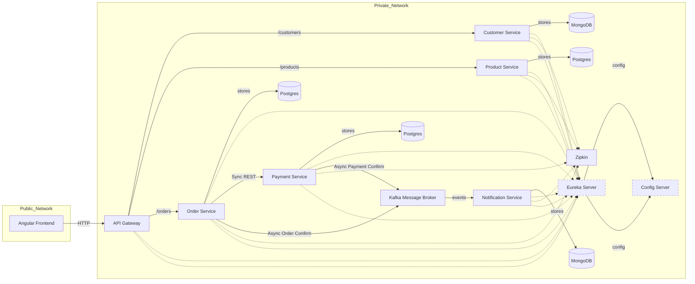

# Ecommerce Microservices Architecture

A distributed, event-driven ecommerce platform built with Spring Boot and Spring Cloud, following best practices in microservice architecture. This project demonstrates how to design, implement, and orchestrate scalable microservices with asynchronous and synchronous communication, centralized configuration, service discovery, distributed tracing, and security.

## Features

✅ Microservice-based architecture  
✅ Spring Boot and Spring Cloud stack  
✅ API Gateway for routing and cross-cutting concerns  
✅ Eureka Discovery Server for service registration and discovery  
✅ Spring Cloud Config Server for centralized configuration management  
✅ Asynchronous communication with Apache Kafka  
✅ Synchronous communication using OpenFeign and RestTemplate  
✅ Distributed tracing with Zipkin and Spring Actuator  
✅ Secured with Keycloak (OAuth2 / OpenID Connect)  
✅ Docker and Docker Compose for containerized deployment  
✅ Clean, modular code structure for easy extensibility

## Architecture

## 🗺️ Architecture Diagram (Mermaid)



This will spin up:

* Eureka Discovery Server
* Spring Cloud Config Server
* Kafka broker
* Zipkin
* Keycloak
* All microservices behind the API Gateway

Each service will register automatically with Eureka.


### Build and Run Individually

If you wish to run a service manually:

```bash
cd order-service
mvn clean install
mvn spring-boot:run
```

## Security

Keycloak is configured as an identity provider.
The API Gateway validates tokens before forwarding requests to downstream services.

## Distributed Tracing

Zipkin collects trace data from all microservices for easier debugging of distributed flows.

## Contributing

Pull requests are welcome! Please open an issue first to discuss what you would like to change.

## License

This project is licensed under the MIT License.

## Author

* Ashifur Nahid
* [LinkedIn](https://www.linkedin.com/in/ashifurnahid/)

