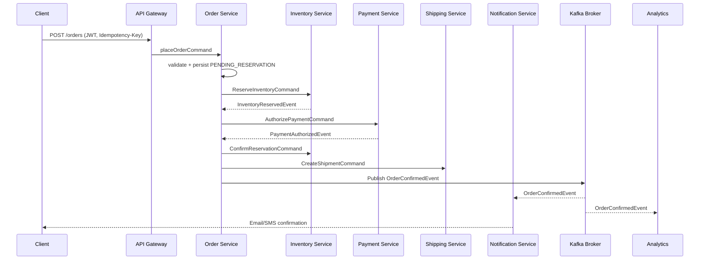
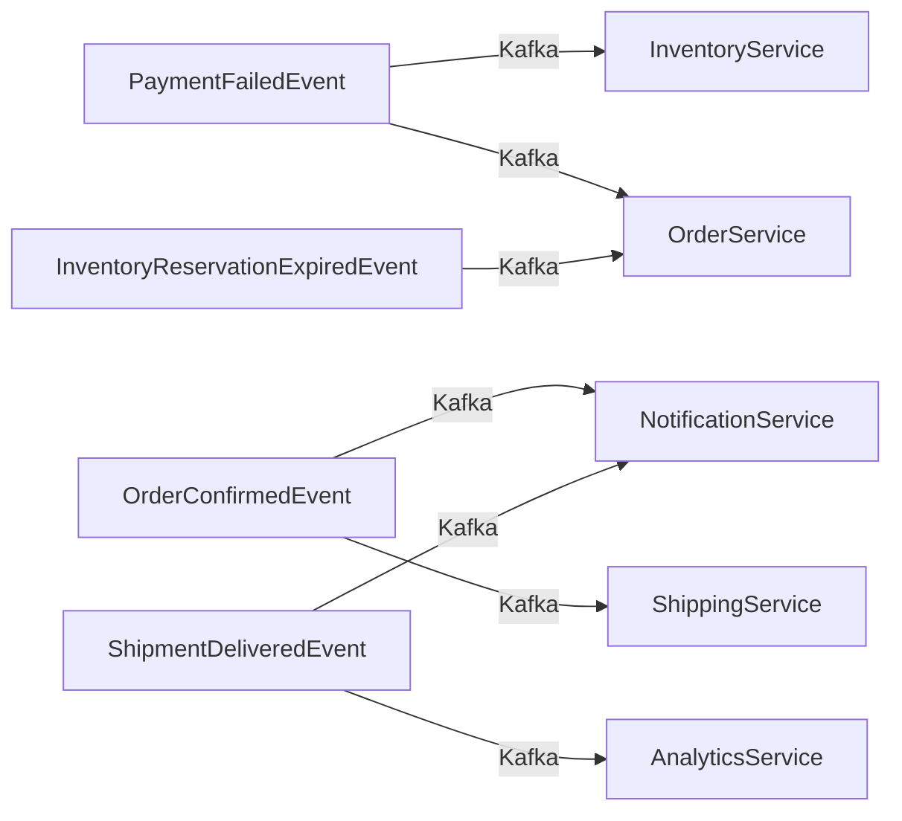
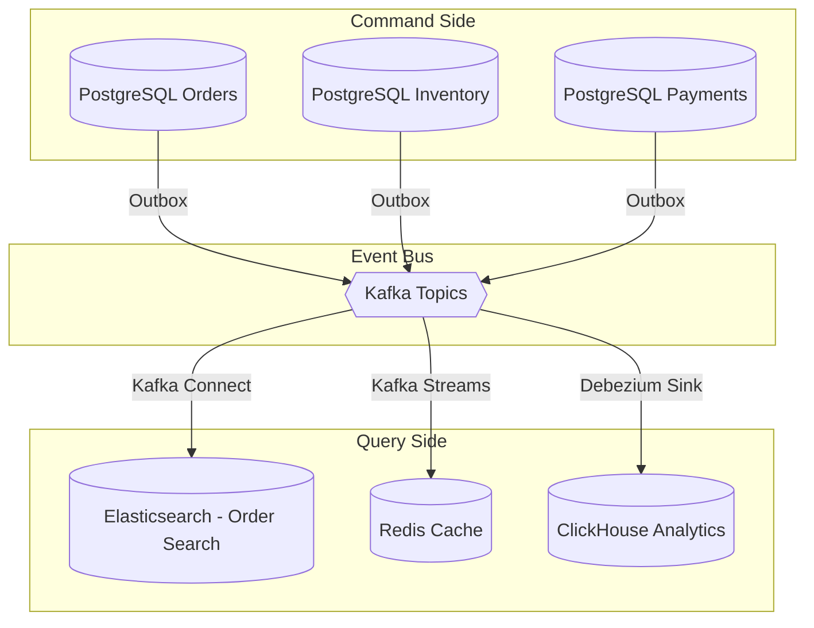

# Production-Grade Ecommerce Microservices Reanalysis

This document re-evaluates the current ecommerce microservices platform against industry practices for domain-driven design (DDD), command-query responsibility segregation (CQRS), and event-driven architecture (EDA). It highlights the target end-state for a production-ready system, summarizes service responsibilities, and provides guidance on implementation, testing, and operational excellence.

## 1. Domain & Bounded Context Overview

| Context | Purpose | Core Aggregates | Upstream Dependencies | Downstream Consumers |
|---------|---------|-----------------|-----------------------|----------------------|
| **Identity & Access** | Authentication, authorization, tenant management, RBAC policies. | User, Role, Permission | External identity provider (Keycloak), audit log. | API Gateway, all services (token introspection). |
| **Catalog** | Product definitions, pricing, promotions, search. | Product, PriceBook, Promotion | Vendor feeds, pricing rules engine. | Cart, Inventory (SKU metadata), Search index, Recommendation engine. |
| **Inventory** | Stock tracking, reservations, replenishment. | InventoryItem, ReservationLedger | Catalog (SKU/warehouse metadata), Procurement. | Order Saga, Fulfillment, Analytics. |
| **Cart & Checkout** | Shopping cart lifecycle, checkout validation. | Cart, CartItem | Catalog (pricing), Identity (customer segments). | Order, Payment (pre-checkout quotes). |
| **Order Management** | Order lifecycle, saga orchestration, fulfillment orchestration. | Order, OrderItem, ShipmentPlan | Cart (checkout payload), Payment, Inventory. | Fulfillment, Notification, Analytics, Customer Support. |
| **Payment** | Payment authorization, capture, refund orchestration. | PaymentIntent, RefundRequest | External payment gateways. | Order Saga, Accounting. |
| **Shipping/Fulfillment** | Warehouse picking, shipment creation, delivery tracking. | FulfillmentTask, Shipment | Order events, Inventory reservations. | Notification, Customer Service, Analytics. |
| **Notification** | Multi-channel messaging (email, SMS, push). | NotificationRequest, Template | Order events, Payment events. | External providers. |
| **Reporting & Analytics** | Materialized views for dashboards, search, KPIs. | Various read models | Domain events. | Business stakeholders, BI tools. |

Each bounded context maps to one or more independently deployable microservices with their own persistence store. Cross-context interactions are mediated through domain events, contracts, or carefully designed synchronous APIs.

## 2. Service Architecture Summary

### Identity Gateway
- **Tech**: Spring Cloud Gateway, OAuth2 resource server.
- **Responsibilities**: Token validation, RBAC enforcement, request throttling, distributed tracing headers.
- **Persistence**: Stateless (leverages Keycloak & Redis for session revocation).
- **Security**: JWT verification, attribute-based policies, WAF integration.

### Customer Service
- **Domain Layer**: Aggregates for `CustomerProfile`, `Address`, `Preference` with invariants around contact methods.
- **Application Layer**: Commands for profile updates, queries for profile retrieval. Publishes `CustomerUpdated` events.
- **Infrastructure Layer**: PostgreSQL for OLTP, Debezium connector for CDC (analytics sync).
- **API Layer**: REST controllers secured by scopes `customer:read` / `customer:write`.

### Catalog Service
- Handles product master data, versioned price books, and promotion rules. Integrates with Elasticsearch for read models (`ProductProjection`). Supports CQRS by splitting write models (PostgreSQL) and search queries (Elasticsearch index). Emits `ProductPriceChanged` events.

### Inventory Service
- Maintains ATP (Available-to-Promise) stock, reservation ledger, backorder queues.
- Implements Try-Confirm/Cancel (TCC) for reservations, exposing commands via REST and event handlers.
- Uses outbox pattern to publish `InventoryReserved`, `InventoryReleased`, `StockAdjusted` events through Kafka.

### Cart Service
- Lightweight service with Redis-backed write model for active carts and PostgreSQL snapshot for audit. Uses event sourcing for cart actions enabling replay for customer support.

### Order Service
- Acts as saga orchestrator. Receives `PlaceOrderCommand`, validates idempotency, and coordinates `Inventory`, `Payment`, and `Shipping` services.
- Implements CQRS by persisting orders in PostgreSQL and projecting read models into ElasticSearch / Materialized view for dashboards (`order_summary` view).
- Exposes GraphQL read API for aggregated order timelines.

### Payment Service
- Integrates with external PSPs using pluggable adapters (Stripe, Adyen). Provides consistent `PaymentIntent` API.
- Uses secure vault (HashiCorp Vault) for API keys, HSM for card tokens.
- Publishes `PaymentAuthorized`, `PaymentCaptured`, `PaymentFailed` events.

### Shipping Service
- Consumes order events, calculates fulfillment plans, interacts with warehouse systems (WMS) and 3PL APIs.
- Maintains shipment tracking statuses and publishes `ShipmentDispatched`, `ShipmentDelivered` events.

### Notification Service
- Subscribes to all major lifecycle events. Applies templating with Mustache/Thymeleaf and handles channel-specific rate limiting.
- Stores notification state in MongoDB for flexible schema.

### Analytics Service
- Builds denormalized projections via Kafka Streams / Debezium, storing in BigQuery or ClickHouse. Provides REST/GraphQL for BI tools.

## 3. Data & Event Flow

### 3.1 Order Placement Saga



### 3.2 Event Choreography Streams



### 3.3 Query Model Refresh



## 4. Key Interaction Snippets

### 4.1 Order Placement Orchestrator (simplified)

```java
@Transactional
public OrderResponse placeOrder(PlaceOrderCommand command) {
    var order = orderFactory.createPendingOrder(command);
    orderRepository.save(order);

    sagaPublisher.startSaga(order.getId(), command.getCorrelationId())
        .step("reserveInventory", () -> inventoryClient.reserve(command.toReserveRequest()))
        .withCompensation(() -> inventoryClient.release(command.toReleaseRequest()))
        .step("authorizePayment", () -> paymentClient.authorize(command.toPaymentRequest()))
        .withCompensation(() -> paymentClient.voidAuthorization(order.getPaymentAuthorizationId()))
        .step("confirmReservation", () -> inventoryClient.confirm(command.toConfirmRequest()))
        .step("createShipment", () -> shippingClient.planShipment(command.toShipmentRequest()))
        .onSuccess(() -> {
            order.confirm();
            outboxPublisher.publish(new OrderConfirmedEvent(order));
        })
        .onFailure(ex -> {
            order.fail(ex.getMessage());
            outboxPublisher.publish(new OrderFailedEvent(order, ex));
        })
        .execute();

    return orderMapper.toResponse(order);
}
```

### 4.2 Payment Event Consumer (idempotent handler)

```java
@KafkaListener(topics = "payment.authorized")
@Transactional
public void handlePaymentAuthorized(PaymentAuthorizedEvent event) {
    if (paymentProjectionRepository.existsById(event.paymentId())) {
        return; // idempotency guard
    }

    var projection = paymentProjectionMapper.toProjection(event);
    paymentProjectionRepository.save(projection);
    metrics.increment("payment.authorized.count");
}
```

### 4.3 Inventory Reservation Repository (optimistic locking)

```java
@Repository
public interface InventoryRepository extends JpaRepository<InventoryItem, UUID> {

    @Lock(LockModeType.OPTIMISTIC_FORCE_INCREMENT)
    Optional<InventoryItem> findBySku(String sku);
}
```

```java
@Transactional
public Reservation reserve(ReserveCommand command) {
    var item = inventoryRepository.findBySku(command.sku())
        .orElseThrow(() -> new InventoryNotFoundException(command.sku()));

    item.reserve(command.quantity());
    reservationRepository.save(new Reservation(item.getSku(), command.quantity(), command.expiry()));
    outboxPublisher.publish(new InventoryReservedEvent(command.orderId(), item.getSku(), command.quantity()));
    return reservation;
}
```

## 5. Security & Identity Propagation

- **Gateway enforcement**: All requests validated using Keycloak-issued JWT access tokens. Include `scope`, `roles`, and `tenant` claims.
- **Service-to-service authentication**: Mutual TLS between services; propagated JWT via `Authorization: Bearer` header to maintain user context.
- **RBAC**: Services enforce method-level security (`@PreAuthorize("hasAuthority('order:write')")`). Use policy enforcement points for fine-grained control.
- **Secrets management**: Integrate with Vault/KMS for credentials; no secrets stored in Git.

## 6. Observability Strategy

| Aspect | Tooling | Implementation Notes |
|--------|---------|-----------------------|
| **Logging** | Structured JSON logs shipped via Filebeat/Fluent Bit to ELK. Include trace IDs, span IDs, user context. |
| **Tracing** | OpenTelemetry SDK with exporters to Jaeger/Zipkin. Gateway seeds trace context; instrumentation covers HTTP, Kafka, database. |
| **Metrics** | Micrometer + Prometheus. Define SLOs (e.g., order placement p95 < 500ms), alerting via Alertmanager. |
| **Dashboards** | Grafana dashboards per domain (order throughput, payment success rate, inventory reservation failures). |
| **Auditing** | Use immutable audit log (Kafka topic + object storage) for compliance. |

## 7. Testing Strategy

- **Unit Tests**: JUnit 5 + Mockito for domain services. Ensure invariants on aggregates (e.g., cannot confirm order before payment).
- **Contract Tests**: Spring Cloud Contract for API Gateway and service APIs. Pact for consumer-driven contracts across teams.
- **Integration Tests**: Testcontainers for PostgreSQL, Kafka, Elasticsearch to verify repository adapters and messaging flows.
- **Saga Tests**: Simulate order saga using embedded Kafka to validate compensating actions.
- **End-to-End Tests**: Cypress/Postman collections triggered in CI, verifying major journeys (guest checkout, registered checkout, refund workflow).
- **Chaos Testing**: Inject failures (Kill Kafka broker, latency injection) using Chaos Mesh/Litmus to validate resilience.

## 8. DevOps & Deployment Pipeline

1. **Build**: Maven multi-module project with reusable BOM. Static code analysis via SonarQube and Qodana.
2. **Containerization**: Each service has `Dockerfile` using multi-stage build (JDK 21 builder, distroless runtime). Non-root execution.
3. **Orchestration**: Docker Compose for local dev, Helm charts / Kustomize for Kubernetes. Utilize Horizontal Pod Autoscaler and PodDisruptionBudgets.
4. **CI/CD**: GitHub Actions pipeline stages: lint -> unit tests -> integration tests -> security scans (Snyk/Trivy) -> build images -> push to registry -> deploy to staging via ArgoCD.
5. **Infra as Code**: Terraform to provision Kafka, PostgreSQL, Redis, observability stack on cloud provider.
6. **Configuration Management**: Spring Cloud Config + Vault integration, feature flags via Unleash/LaunchDarkly.

## 9. Design Gaps & Mitigations

| Gap | Impact | Mitigation |
|-----|--------|------------|
| **Idempotency coverage** | Duplicate orders/payments on retries. | Enforce idempotency keys per user on write endpoints; store results with TTL; leverage deduplication in message consumers. |
| **Saga timeouts** | Long-running steps cause stuck orders. | Implement saga timeout policies with compensation; store saga state in durable store; expose admin tooling for manual recovery. |
| **Schema evolution** | Breaking changes propagate to consumers. | Use Avro/Protobuf schemas with versioning; automate compatibility checks in CI. |
| **Backpressure on Kafka** | Event spikes overwhelm consumers. | Configure consumer lag monitoring, use partitions with adequate parallelism, enable circuit breakers and bulkheads on downstream dependencies. |
| **Data privacy** | Sensitive data in logs/events. | Apply field-level encryption, data masking policies, and secure logging filters. |
| **Operational silos** | Teams lack visibility across services. | Create cross-domain runbooks, shared dashboards, and incident response playbooks. |

## 10. Production Readiness Checklist

- [ ] Automated database migrations via Flyway/Liquibase per service.
- [ ] Health probes (`/actuator/health`) with readiness checks for downstream dependencies.
- [ ] Circuit breakers (Resilience4j) on synchronous calls with fallback strategies.
- [ ] Rate limiting & throttling at gateway and per-service.
- [ ] Blue/green or canary deployments with automated rollback.
- [ ] Regular penetration tests & dependency vulnerability scanning.

---

This reanalysis establishes a roadmap to harden the ecommerce platform with DDD-aligned boundaries, resilient saga orchestration, and operational guardrails required for production-grade deployments.
